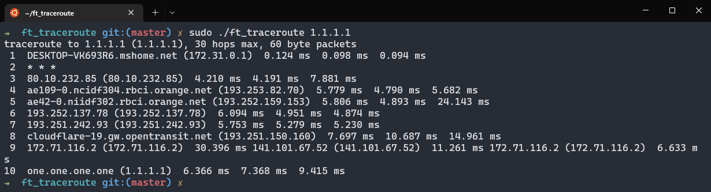

# ft_traceroute

Reimplementation of the command traceroute in C.

ft_traceroute tracks the route packets taken from an IP network on their way to a given host. It utilizes the IP protocol's time to live (TTL) field and attempts to elicit an `ICMP TIME_EXCEEDED` response from each gateway along the path to the host. ft_traceroute works with either `UDP` or `ICMP` requests.<br>
ft_traceroute is fully compatible with **IPV4** and **IPV6** adresses and handles DNS resolution.

# Usage

Do `make` and then run :

```bash
sudo ./ft_traceroute [-46dIn] [-f first_ttl] [-m max_ttl] [-p port] [-q nqueries] host [packetlen]
```



> You are requiered to run the program with sudo because the program uses raw sockets (`SOCK_RAW` with the socket function for the ICMP socket).

Or you can also use `make run` to run the program with the specified otions in the makefile.

The following options and arguments are handled by the program:

```bash
Options:
  -4                 Use IPv4
  -6                 Use IPv6
  -d                 Enable socket level debugging
  -f first_ttl       Start from the first_ttl hop (instead from 1)
  -I                 Use ICMP ECHO for tracerouting
  -m max_ttl         Set the max number of hops (max TTL to be reached). Default is 30
  -n                 Do not resolve IP addresses to their domain names
  -p port            Set the destination port to use. It is either initial udp port value for "default"
                     method (incremented by each probe, default is 33434), or initial seq for "icmp"
					 (incremented as well, default from 1)
  -q nqueries        Set the number of probes per each hop. Default is 3
  --help             Read this help and exit

Arguments:
  host               The host to traceroute to
  packetlen          The full packet length (default is the length of an IP header plus 40).
```

We also have a `ipv6` branch that you can look at if you want to understand how a basic **IPv6** ft_traceroute works. It only supports **IPv6**, lacks a lot of features and is only made for **educational purposes**.

# Checksum

> If you want a basic explanation of how checksums work, you can read [this](https://github.com/execrate0/ft_ping#checksum). This implementation is an upgrade of the one in our ft_ping.<br>
> We'd like to remind you that you do NOT need to calculate the checksum for the UDP packets and ICMP packets (only when using IPV6).

```c
unsigned short checksum(unsigned short *addr, size_t len)
{
	unsigned long sum = 0;
	for (; len > sizeof(char); len -= sizeof(short))
		sum += *addr++;
	if (len == sizeof(char))
		sum += *(unsigned char *)addr;
	unsigned char bits = sizeof(short) * 8;
	while (sum >> bits)
		sum = (sum & ((1 << bits) - 1)) + (sum >> bits);
	return (~sum);
}
```

# Docs
We heavily recommend reading the following headers files (along with the ones from our [ft_ping](https://github.com/execrate0/ft_ping#Docs)):
- `<x86_64-linux-gnu/bits/socket.h>`
- `<netinet/in.h>`
<br><br>
- [RFC1393](https://www.rfc-editor.org/rfc/rfc1393) - Traceroute Using an IP Option


## MADE WITH LOVE BY :

<!-- ALL-CONTRIBUTORS-LIST:START - Do not remove or modify this section -->
<!-- prettier-ignore-start -->
<!-- markdownlint-disable -->
<table>
  <tr>
    <td align="center"><a href="https://github.com/execrate0/"><br /><sub><b>execrate0 (ahallain)</b></sub></a><br /><a href="https://profile.intra.42.fr/users/ahallain" title="Intra 42"></a></td>
    <td align="center"><a href="https://github.com/assxios/"><br /><sub><b>Assxios (droge)</b></sub></a><br /><a href="https://profile.intra.42.fr/users/droge" title="Intra 42"></a></td>
  </tr>
</table>
<!-- markdownlint-restore -->
<!-- prettier-ignore-end -->
<!-- ALL-CONTRIBUTORS-LIST:END -->